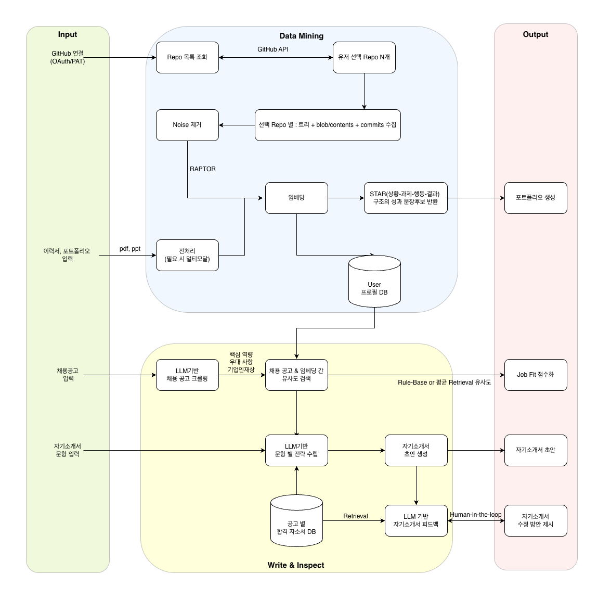
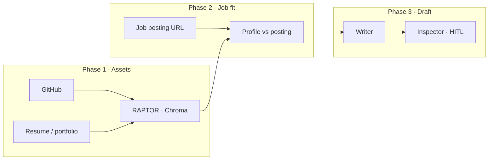
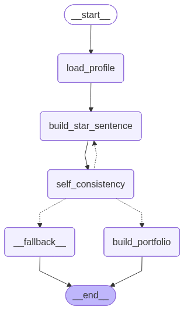
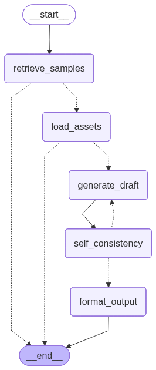
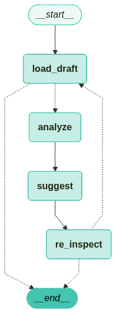
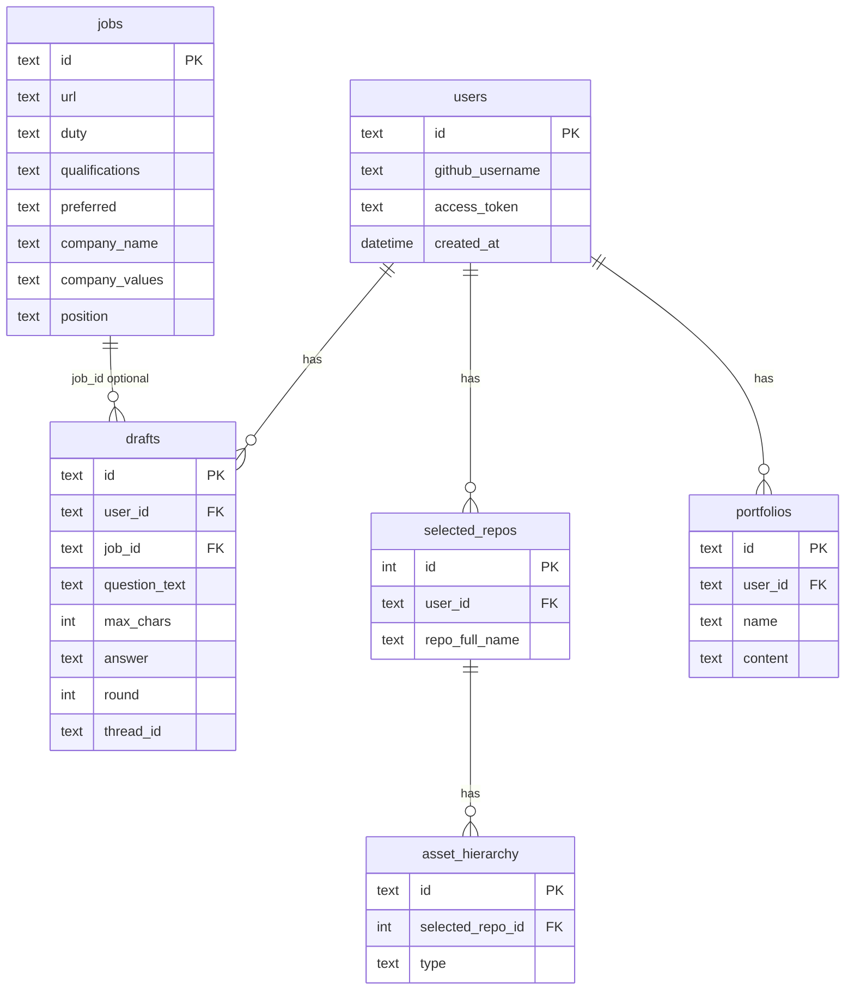

<div align="center">

<br/>

# Autofolio

### *From Code to Career*

<br/>


<br/><br/>

> **자소서를 꾸미는 도구가 아니라,**  
> **코드와 커밋이 말해 주는 경험을 채용 담당자 앞에 세우는 엔진.**

채용 공고 한 줄, 자기소개서 문항 하나 — 그 사이를 메우는 건 추측이 아니라 **GitHub·문서·에셋에서 꺼낸 근거**다.  
Autofolio는 그 근거를 모으고, 맞추고, **초안까지 써 내려가는** 백엔드·에이전트 파이프라인이다.

<br/>



<br/><br/>

</div>

---

## 목차

1. [한 장으로 보는 흐름](#한-장으로-보는-흐름) · [세 개의 엔진](#세-개의-엔진) · [왜 존재하는가](#왜-존재하는가)
2. [제품 기획](#1-제품-기획)
3. [전체 파이프라인 (Phase 1~3)](#2-전체-파이프라인-phase-13)
4. [RAG 파이프라인 핵심](#3-rag-파이프라인-핵심)
5. [임베딩 전략 (폴더 기반 RAPTOR)](#4-임베딩-전략-폴더-기반-raptor)
6. [GitHub 임베딩 구현 요지](#5-github-임베딩-구현-요지)
7. [LangGraph 설계](#6-langgraph-설계)
8. [Writer · Inspector 상세](#7-writer--inspector-상세)
9. [REST API 명세](#8-rest-api-명세)
10. [데이터베이스 스키마](#9-데이터베이스-스키마)
11. [User Asset · 합격 자소서 벡터](#10-user-asset--합격-자소서-벡터)
12. [GitHub OAuth](#11-github-oauth)
13. [채용 공고 파싱](#12-채용-공고-파싱)
14. [합격 자소서 크롤링 저장 전략](#13-합격-자소서-크롤링-저장-전략)
15. [저장소 디렉터리 구조](#14-저장소-디렉터리-구조)
16. [테스트 가이드](#15-테스트-가이드)
17. [16주 팀 계획 (요약)](#16-16주-팀-계획-요약)
18. [실행 방법](#17-실행-방법)
19. [기여](#18-기여)

---

## 한 장으로 보는 흐름

**자산화 → 공고와의 정렬 → 초안·첨삭.**



---

## 세 개의 엔진

<table>
  <tr>
    <td align="center" width="33%">
      <strong>Portfolio</strong><br/>
      <sub>STAR · 일관성 검증 · 웹 포트폴리오</sub><br/><br/>
      
    </td>
    <td align="center" width="33%">
      <strong>Writer</strong><br/>
      <sub>합격 샘플 · 에셋 RAG · 초안 생성</sub><br/><br/>
      
    </td>
    <td align="center" width="33%">
      <strong>Inspector</strong><br/>
      <sub>보완 제안 · 대화형 첨삭</sub><br/><br/>
      
    </td>
  </tr>
</table>

---

## 왜 존재하는가

| 끊기는 지점 | Autofolio의 답 |
|-------------|----------------|
| 코드는 있는데 **이력서 문장으로 번역**이 안 된다 | 커밋·파일·문서를 **검색 가능한 에셋**으로 승격 |
| LLM 자소서는 **없는 경험**을 쓰기 쉽다 | RAG·검증 노드로 **환각을 줄이는 구조** |
| “열심히 했습니다”만 있고 **증거가 없다** | Writer·Inspector가 **근거 카드**와 같은 테이블 위에서 동작 |

---

## 1. 제품 기획

**슬로건:** From Code to Career — 증거 기반 개발자 이력서

### 문제 정의

| 구분 | 설명 |
|------|------|
| Developers hate writing | 코드는 잘 짜지만 채용 담당자 언어(비즈니스 임팩트)로 번역하기 어렵다. |
| The "Hallucination" Trap | 일반 LLM 자소서는 없는 경험을 지어내거나 미사여구만 남기기 쉽다. |
| Disconnected Evidence | 주장과 GitHub 커밋·코드가 분리되면 신뢰가 떨어진다. |

### 솔루션

> "자소서를 쓰는 게 아니라, 내 경험을 문서화(Documentation)한다."

**GitHub 코드/커밋**과 **이력서/포트폴리오**를 수집해 **검증된 성과(Asset)**로 바꾸고, **채용 공고(Target)**에 맞는 증거를 조합해 **신뢰 가능한 자소서 초안** 작성을 돕는다.

### 입력 소스

| 입력 | 포맷 | 처리 |
|------|------|------|
| GitHub | 코드, 커밋 | GitHub API → 기본 제외 → RAPTOR 임베딩 |
| 이력서 | PDF, PPT | 전처리(필요 시 멀티모달 LLM) |
| 포트폴리오 | PDF, PPT | 동일 |

→ 모든 소스는 **User 프로필 DB**로 통합.

### Phase별 핵심 기능

**Phase 1 — Data Mining & Portfolio (“진흙 속의 진주”)**

| 기능 | 설명 |
|------|------|
| GitHub 연결 | OAuth/PAT → 레포 목록 → **유저가 선택한 레포만** 분석 |
| 이력서/포트폴리오 업로드 | PDF/PPT → 멀티모달 전처리 → 텍스트·구조 추출 |
| 기본 제외 | `node_modules`, `.git` 등 (RAPTOR가 상위에서 정제) |
| RAPTOR 임베딩 | 폴더 구조 기반 계층 요약 → Vector DB |
| Asset Generation | 코드·커밋·문서 → STAR 성과 문장 후보 |
| 포트폴리오 생성 | 분석 데이터 기반 웹 포트폴리오 |

**Phase 2 — Job Intelligence (“지피지기”)**

| 기능 | 설명 |
|------|------|
| 채용 공고 파싱 | URL → LLM 기반 크롤링 → 담당업무·자격·우대·기업명·인재상·포지션명 |
| 자소서 문항 입력 | 유저가 문항 직접 입력 |
| Job Fit | User DB(프로필·임베딩) vs 공고 파싱 결과 비교 → 점수 API |
| 문항·에셋 매칭 | 문항·공고에 맞는 에셋 선별(draft 내부) |

**Phase 3 — Evidence-Based IDE (“팩트로 글을 제압”)**

| 기능 | 설명 |
|------|------|
| Split-View UI | 좌: 근거 카드, 우측: 에디터 |
| Writer | 합격 자소서 샘플 + 유저 에셋 → **초안** |
| Inspector | 문장별 **보완 제안** — **실제 수정은 유저** |
| 대화형 첨삭 | 수정 후 Inspector와 반복 |
| (추후) Inspector에서 코드/커밋 UI 직접 노출 | 부가 기능 |

### 기술 스택 (기획 기준)

| 구분 | 기술 | 역할 |
|------|------|------|
| Orchestration | LangGraph | Writer/Inspector/Portfolio 상태 관리 |
| LLM | GPT-4o 등 | 분석·생성·멀티모달 전처리 |
| Vector DB | Chroma | 청크 임베딩·시맨틱 검색(RAPTOR) |
| Backend | FastAPI | 비동기 API |
| Frontend | React/Next.js (기획) | Split-View UI |
| 데이터 | GitHub API | 레포·트리·커밋 |
| 공고 | LLM 기반 크롤링 | URL 접근 + 구조화 추출 단일 스텝 |
| 합격 자소서 | 잡코리아·링커리어 | 크롤링 → DB |

### 제약·범위

| 항목 | 결정 |
|------|------|
| 채용 공고 크롤링 법적 이슈 | 당장 진행, 필요 시 재검토 |
| Inspector의 코드/커밋 UI 노출 | 추후 부가 기능 |
| GitHub API Rate Limit | 당장 미고려, 구현 시 대응 |
| 합격 자소서 크롤링 | 잡코리아·링커리어만(robots 확인) |
| GitHub 연동 “해제” API | 미제공 — 로그아웃으로 대체 |

### 기대 효과

- **Zero Hallucination 지향:** 문장과 코드·커밋·문서 수준의 증거 연결
- **Efficiency:** 증거 기반 조립으로 작성 시간 단축 목표
- **Recruiter Friendly:** 실제 코드/커밋과 연결된 구조

---

## 2. 전체 파이프라인 (Phase 1~3)

Phase 1에서 User 프로필(Vector)을 쌓고 → Phase 2에서 공고·Job Fit·문항을 묶고 → Phase 3에서 Writer/Inspector로 초안·첨삭.

<details>
<summary><strong>전체 ASCII 파이프라인 (펼치기)</strong></summary>

```
┌─────────────────────────────────────────────────────────────────────────────┐
│  Phase 1: Data Mining & Portfolio                                           │
├─────────────────────────────────────────────────────────────────────────────┤
│   [입력 1] GitHub 연결 (OAuth/PAT) → 레포 목록 ↔ 유저 선택 레포 N개           │
│        → 선택 레포별: 트리 + blob/contents + commits (기본 제외)             │
│   [입력 2] 이력서/포트폴리오 (pdf, ppt) → 전처리(멀티모달 LLM)                 │
│        → RAPTOR 임베딩 (파일 → 폴더 요약 → 상위 → 루트)                        │
│        → Asset Generation (STAR 후보) → User 프로필 DB (Vector)              │
│        → 포트폴리오 생성 ─┬─ Phase 2로 전달                                   │
└─────────────────────────┼───────────────────────────────────────────────────┘
                          ▼
┌─────────────────────────────────────────────────────────────────────────────┐
│  Phase 2: Job Intelligence                                                  │
│   채용 공고 URL → LLM 크롤링(단일 스텝) → 구조화 필드 추출                     │
│        → User DB vs 공고 → Job Fit 점수 API                                   │
│        → 자기소개서 문항 입력 → Writer 그래프 내부: 유사 샘플 → load_assets    │
└─────────────────────────┬───────────────────────────────────────────────────┘
                          ▼
┌─────────────────────────────────────────────────────────────────────────────┐
│  Phase 3: Write & Inspect                                                   │
│   합격 자소서 DB ◄── Retrieval                                              │
│   문항 선택 → Writer(에셋+합격DB) → 초안 → 유저 수정 ↔ Inspector(HITL)        │
└─────────────────────────────────────────────────────────────────────────────┘
```

</details>

### Output 정리

| Output | 설명 |
|--------|------|
| 포트폴리오 | Phase 1 웹/구조화 결과 |
| Job Fit 점수 | 공고 ↔ 프로필 매칭 |
| 자기소개서 초안 | Writer 출력 |
| 수정 방안 | Inspector 피드백(Human-in-the-loop) |

### Phase 요약 표

| Phase | 핵심 흐름 |
|-------|-----------|
| **1** | GitHub + 이력서/포트폴리오 → 기본 제외·전처리 → RAPTOR → 에셋 → User DB |
| **2** | 공고 URL(LLM 크롤링) → Job Fit → 문항 → Writer 준비(유사 샘플 → 에셋) |
| **3** | 합격 DB 참고 → Writer 초안 → 유저 수정 → Inspector → HITL 반복 |

---

## 3. RAG 파이프라인 핵심

### 인덱싱 (무엇을 검색 가능하게 할지)

| 순서 | 단계 | 설명 |
|------|------|------|
| 1 | User 프로필 | GitHub + 이력서/포트폴리오 → RAPTOR → Vector DB |
| 2 | 에셋 | 코드·커밋·문서 → STAR 후보 → 프로필과 함께 관리 |
| 3 | 합격 자소서 | 잡코리아/링커리어 크롤링 → DB(문항·회사·연도·키워드 검색) |

### 검색 (언제 무엇을 가져오나)

| 순서 | 시점 | 검색 | 용도 |
|------|------|------|------|
| 1 | Job Fit | User DB vs 공고 파싱 결과 | 적합도 점수·순위 |
| 2 | Writer 준비 | 합격 자소서 검색 → **에셋** 조회 | 초안 컨텍스트 — **순서: 유사 샘플 → 유저 DB** |
| 3 | Inspector | 에셋·합격 샘플 **무조건 재조회** | 첨삭 근거 보강 |

### 생성

| 단계 | 입력 | 출력 |
|------|------|------|
| Writer | 문항 + 공고(파싱) + 합격 샘플 + 에셋 | 자소서 **초안** |
| Inspector | 초안 + 에셋·합격 샘플(재조회) | **보완 제안** → Human 수정 후 반복 |

### 한 줄 흐름

```
[인덱싱] User 프로필(RAPTOR) + 에셋 + 합격 자소서 → DB
    ↓
[검색] Job Fit / Writer(합격 자소서 → 에셋) / Inspector(에셋·샘플)
    ↓
[생성] Writer(초안) → Inspector(첨삭) → Human-in-the-loop
```

---

## 4. 임베딩 전략 (폴더 기반 RAPTOR)

- **클러스터링 대신 실제 폴더 구조**를 트리로 사용 — 결정적·재현성·개발자 직관과 일치.
- **code(leaf):** 파일 단위 임베딩(본인 커밋만 정책, MVP 생략 가능).
- **folder(mid):** 하위 code·folder 요약을 묶어 LLM 요약 → bottom-up.
- **project(root):** 레포 루트 전체 요약.

**구현 흐름 (요약)**

1. 대상 목록: SQLite `asset_hierarchy`에서 유저가 선택 API로 넣은 **`type=code`** 행의 `id`(path SSoT)만 사용 — 임베딩 단계에서 **전체 트리 노이즈 필터 없음**.
2. code: 파일(blob)별 document(summary 우선, 없으면 content, truncate) → 임베딩.
3. folder: 경로 `/` 기준으로 **가장 깊은 디렉터리부터** 상향, 직계 하위만 묶어 LLM 요약 → folder 임베딩.
4. project: 루트에서 레포 전체 요약.

장점: 클러스터링 불필요, 결정적 트리, 직관적 검색(예: auth 폴더), 비용 절감.

---

## 5. GitHub 임베딩 구현 요지

- **트리거:** `POST /api/github/repos/{repo_id}/embedding`
- **전제:** 해당 레포가 `selected_repos`에 등록되어 있어야 함 — **미등록 시 403**.
- **대상:** `asset_hierarchy`에 이미 올라간 **`type=code`** 행의 `id`만 순회 — **Trees API로 전체 스캔 후 필터링하지 않음**.
- **동기화:** `id` = Chroma document id = 경로 SSoT; folder/project는 RAPTOR 후 `asset_hierarchy`에 반영.
- **컬렉션:** Chroma `user_assets_{user_id}` upsert.

---

## 6. LangGraph 설계

| # | 그래프 | Phase | 입력 | 출력 |
|---|--------|-------|------|------|
| 1 | 포트폴리오 생성 | 1 | User 프로필, 에셋 | 포트폴리오 |
| 2 | Writer | 3 | user_id, 문항, 합격 샘플 검색 → 에셋 | 자소서 초안 |
| 3 | Inspector | 3 | 초안, (선택) 유저 수정본 | 보완 제안, HITL |

- **전략 수립 그래프:** 현재 범위 **미사용**.
- **Job Fit:** 그래프 없이 **단일 API**(프로필·임베딩 vs 공고 파싱 결과).

### 6.1 포트폴리오 그래프

```
[START] → load_profile → build_star_sentence → self_consistency ─(통과)→ build_portfolio → [END]
                              ↑                      │
                              │    (실패 & retry<3) → build_star_sentence (feedback 반영)
                              │    (실패 & retry≥3) → build_portfolio
```

- **max_star_retries:** 3. 상한 초과 시 `build_portfolio`로 진행.
- **Hallucination:** STAR에 retrieval에 없는 내용이 있으면 실패 처리·피드백 재생성.

**State (TypedDict, 요지)**

```python
class PortfolioState(TypedDict, total=False):
    user_id: str
    profile: dict
    assets: list
    star: list
    is_hallucination: bool
    is_star: bool
    star_retry_count: int
    portfolio: dict | str
    consistency_feedback: dict
```

### 6.2 Writer 그래프

```
[START] → retrieve_samples → load_assets → generate_draft → self_consistency ─(통과)→ format_output → [END]
```

- **max_draft_retries:** 3. 실패 시 `consistency_feedback`로 `generate_draft` 재호출.
- **순서:** 유사 합격 샘플 → **유저 에셋** → 초안 → 검증 → 포맷.

**State (요지)**

```python
class WriterState(TypedDict, total=False):
    user_id: str
    assets: list
    question: str
    max_chars: int
    job_parsed: dict
    samples: list
    draft: str
    is_hallucination: bool
    draft_retry_count: int
    consistency_feedback: dict
    messages: list
    error: str
```

### 6.3 Inspector 그래프

```
[START] → load_draft → analyze → suggest → [Human 대기] → re_inspect → load_draft → ...
```

- **`load_draft`:** 에셋·합격 샘플 **무조건 재조회** (Writer와 동일 모듈).
- **max_rounds:** 기본 **5**.
- **interrupt:** `suggest` 후 Human 입력 대기, `user_edited`로 재진입.

**State (요지)**

```python
class InspectorState(TypedDict, total=False):
    draft: str
    assets: list
    samples: list
    suggestions: list
    user_edited: str
    round: int
    error: str
```

### 그래프 ↔ 모듈

| 호출 주체 | 대상 | 비고 |
|-----------|------|------|
| Writer `retrieve_samples` | 합격 자소서 검색 **모듈** | 별도 공개 API 없음 |
| Writer `load_assets` | User 에셋/프로필 | P1 API 또는 DB |
| Inspector `load_draft` | 에셋·합격 샘플 재조회 | Writer와 동일 |
| Portfolio `load_profile` | 프로필·에셋 | P1 API 또는 DB |

---

## 7. Writer · Inspector 상세

### Writer

- **경로:** `POST /api/cover-letter/draft` — `questions[]` 다문항 시 문항별로 Writer 그래프 호출.
- **입력:** `job_id`(선택), `questions[]` (각각 `question_text`, `max_chars` 필수).
- **출력:** `drafts[]` (draft_id, question_text, answer, char_count 등).

| 노드 | 역할 |
|------|------|
| retrieve_samples | 진입 검증 + 합격 자소서 검색 (없어도 다음 진행) |
| load_assets | 문항·공고 기반 에셋 선별 |
| generate_draft | LLM 초안 (`consistency_feedback` 재진입 반영) |
| self_consistency | 환각 검사 |
| format_output | 글자수·형식 (`max_chars`) |

### Inspector

- **경로:** `POST /api/cover-letter/inspect`
- **입력:** `draft`, `user_edited`(선택), `question`, `job_parsed`(선택) — **에셋·샘플은 body로 받지 않음** (`load_draft`에서 조회).
- **출력:** `suggestions`, `overall_score`(0~100, API 스펙 기준)

| 노드 | 역할 |
|------|------|
| load_draft | 검증 + 에셋·합격 샘플 **강제 재조회** |
| analyze | LLM 보완점 → suggestions |
| suggest | 제안 반환 + interrupt |
| re_inspect | 수정본 반영, round 증가 |

---

## 8. REST API 명세

### 공통

- **Content-Type:** `application/json` (파일은 `multipart/form-data`)
- **인증:** 세션 쿠키 또는 `Authorization: Bearer <app-session-token>`

**에러 JSON**

```json
{ "error": "ERROR_CODE", "message": "사람이 읽을 수 있는 설명" }
```

| HTTP | error | 조건 |
|------|-------|------|
| 400 | BAD_REQUEST | 파라미터 누락·형식 오류 |
| 401 | UNAUTHORIZED | 세션 없음·만료 |
| 403 | FORBIDDEN | 권한 없음 |
| 404 | NOT_FOUND | 리소스 없음 |
| 500 | INTERNAL_SERVER_ERROR | 서버 오류 |
| 502 | GITHUB_UPSTREAM_ERROR | GitHub API 실패(GitHub 연동만) |

### 인증 (Auth)

| 메서드 | 경로 | 설명 |
|--------|------|------|
| GET | `/api/auth/github/login` | GitHub OAuth authorize로 302 |
| GET | `/api/auth/github/callback` | code 교환·세션·302 → `/dashboard` |
| GET | `/api/auth/logout` | 세션 무효·302 |
| GET | `/api/me` | user_id, github_login, github_id, email, avatar_url |

### GitHub

Base: `/api/github` (선택 레포는 `/api/user`)

| 메서드 | 경로 | 설명 |
|--------|------|------|
| GET | `/api/github/repos` | 레포 목록 |
| GET | `/api/user/selected-repos` | 선택 레포 조회 |
| PUT | `/api/user/selected-repos` | 선택 레포 저장 |
| GET | `/api/github/repos/{repo_id}/files` | 파일 트리 |
| GET | `/api/github/repos/{repo_id}/contents` | 단일 파일 내용 |
| GET | `/api/github/repos/{repo_id}/commits` | 커밋 목록 |
| POST | `/api/github/repos/{repo_id}/embedding` | 임베딩 — **selected_repos 등록 레포만**, `paths[]` 등은 구현·명세에 맞춤 |

### 서비스 (문서·공고·자소서·포트폴리오)

채용공고는 **`POST /api/jobs/parse` 시 항상 `jobs`에 저장**되며 응답 **`job_id`** 반환. 이후 job-fit, cover-letter, portfolio는 **`job_id`만** 넘기면 되고, 없으면 공고 맥락 없이 범용 생성.

| 메서드 | 경로 | 설명 |
|--------|------|------|
| POST | `/api/user/documents` | 이력서/포트폴리오 PDF·PPT 업로드 → OCR 등 → VectorDB |
| POST | `/api/jobs/parse` | `source_type=url` 또는 `manual` — 저장 후 `job_id` |
| POST | `/api/job-fit` | Job Fit (job_id 선택) |
| POST | `/api/cover-letter/draft` | 초안 — `questions[]` 다문항 → `drafts[]` |
| POST | `/api/cover-letter/inspect` | 검수 — `answers[]` → `feedbacks[]`, `overall_score` 0~100 |
| POST | `/api/portfolio/generate` | 포트폴리오 생성 (job_id 선택) |
| GET | `/api/portfolio` | 목록/단건 |

- 레포 소스는 요청 바디가 아니라 **`selected_repos`(SSoT)**.
- 이력서/포트폴리오 없이 **GitHub 임베딩만**으로도 자소서·포트폴리오 생성 가능.

### 권장 API 호출 순서

1. `GET /api/auth/github/login` → `callback` → `GET /api/me`
2. `GET /api/github/repos` → `PUT /api/user/selected-repos`
3. (선택) `POST /api/user/documents`
4. `POST /api/github/repos/{id}/embedding`
5. `POST /api/jobs/parse` → `job_id` 확보
6. `POST /api/job-fit`
7. `POST /api/cover-letter/draft` → `POST /api/cover-letter/inspect`
8. `POST /api/portfolio/generate` → `GET /api/portfolio`

---

## 9. 데이터베이스 스키마

| 저장소 | 용도 |
|--------|------|
| **SQLite** | users, drafts, jobs, selected_repos, asset_hierarchy, portfolios |
| **Chroma** | `passed_cover_letters` (합격 자소서 유사 검색) |
| **Chroma** | `user_assets_{user_id}` (RAPTOR, Job Fit, Writer/Inspector) |

### SQLite 테이블 요약

**users**

| 컬럼 | 설명 |
|------|------|
| id (PK) | 유저 ID (GitHub id 등) |
| github_username, github_id, email, avatar_url | 프로필 |
| access_token | OAuth (암호화 권장) |
| created_at, updated_at | 시각 |

**drafts** (문항 단위, `draft_id` = `drafts.id`)

| 컬럼 | 설명 |
|------|------|
| id (PK) | UUID |
| user_id FK | users |
| job_id FK | jobs (nullable) |
| question_text, max_chars, answer | 문항·초안 |
| round | Inspector 라운드 (0=최초) |
| thread_id | Inspector HITL checkpointer |
| created_at, updated_at | 시각 |

**jobs** — `POST /api/jobs/parse`마다 저장

| 컬럼 | 설명 |
|------|------|
| id (PK) | URL hash 또는 manual 시 UUID |
| url | 공고 URL |
| duty, qualifications, preferred | 담당·자격·우대 |
| company_name, company_values, position | 기업·인재상·포지션 |
| created_at | 파싱 시각 |

**selected_repos**

| 컬럼 | 설명 |
|------|------|
| id (PK) | INTEGER |
| user_id FK | users |
| repo_full_name | owner/repo |
| created_at | 시각 |

**asset_hierarchy** — `id` **= 경로 SSoT** (Chroma document id와 동일)

| 컬럼 | 설명 |
|------|------|
| id (PK) | 예: `owner/repo/src/auth/login.py` |
| selected_repo_id FK | selected_repos |
| type | `code` \| `folder` \| `project` |

**portfolios**

| 컬럼 | 설명 |
|------|------|
| id (PK) | UUID |
| user_id FK | users |
| name | 포트폴리오명 |
| content | 생성 결과 JSON/HTML |
| created_at, updated_at | 시각 |

### ER 다이어그램 (Mermaid)



**ASCII 관계**

```
users
  ├── drafts (job_id → jobs, optional)
  ├── selected_repos → asset_hierarchy (id = path SSoT)
  └── portfolios
jobs (독립 저장, job_id로 참조)
```

---

## 10. User Asset · 합격 자소서 벡터

### User Asset (Chroma `user_assets_{user_id}`)

| type | 의미 | source |
|------|------|--------|
| code | 소스 파일(leaf) | github |
| folder | 폴더 요약(mid) | github |
| project | 레포 루트(root) | github |
| document | 이력서/포트폴리오 청크 | resume, portfolio |

**metadata (MVP 4키):** `type`, `source`, `repo`, `path`

**임베딩 텍스트:** code/document는 summary 우선·없으면 content(truncate); folder/project는 LLM 요약.

**포트폴리오 STAR 다중 쿼리 (recall 향상):** STAR 관점별 **5개 쿼리**를 병렬 실행 후 **동일 id는 최소 distance**만 남기고 `top_k` 정렬.

| 쿼리 | 관점 | 키워드 예 |
|------|------|-----------|
| Q1 | Situation/Task | problem, legacy, bottleneck, incident |
| Q2 | Action·트러블슈팅 | performance, latency, debugging |
| Q3 | Action·아키텍처 | architecture, refactoring, design pattern |
| Q4 | Action·구현 | API, CI/CD, test |
| Q5 | Result | impact, metric, business value |

**조회 시그니처 (개념)**

```python
async def retrieve_user_assets(
    user_id: str,
    source_filter: list[str] | None = None,
    type_filter: list[str] | None = None,
    top_k: int = 20,
) -> list[dict]: ...
```

### 합격 자소서 (Chroma `passed_cover_letters`)

- **단위:** 문항(question) 하나당 문서 하나.
- **임베딩 문자열 형식:** `{company}의 {year}년 {position} 공고의 자기소개서 문항 {n} : {question}`
- **검색:** 동일 형식으로 쿼리 임베딩 → 메타 필터(company, position, year) → top_k → `(question, answer)` 쌍.

---

## 11. GitHub OAuth

- **Web Application Flow:** authorize → `code` → `access_token` 교환(백엔드에서만, client_secret 노출 금지).
- **OAuth App 등록:** GitHub → Settings → Developer settings → OAuth Apps → New.
  - **Authorization callback URL:** 예 `https://your-domain.com/api/auth/github/callback` (로컬은 `http://127.0.0.1:8000/...` 등)
- **권장:** `state`(CSRF), PKCE(`code_challenge` S256).
- **스코프:** 예 `repo`, `read:user` 등 — 서비스 요구에 맞게.

로컬 개발용 환경 변수는 `.env.example` 참고.

---

## 12. 채용 공고 파싱

- **컨셉:** 크롤링·전처리·추출을 나누지 않고 **LLM + 웹 접근으로 단일 스텝**.
- **추출 필드 (6가지):** 담당업무, 자격요건, 우대사항, 기업명, 기업 인재상, 포지션명.
- **자소서 문항**은 파싱 대상이 아니라 **유저 직접 입력**.

---

## 13. 합격 자소서 크롤링 저장 전략

**2단계 저장 (잡코리아 예시)**

| 단계 | 목적 | 출력 |
|------|------|------|
| 1 | 리스트에서 상세 URL만 수집 | `data/jobkorea_urls.json` — `[{id, url}, ...]` |
| 2 | URL 순회하며 상세 크롤링 | `data/jobkorea/{id}.json` — 문서당 1파일 |

상세 JSON 스키마: `id`, `source`, `url`, `crawled_at`, `company`, `position`, `year`, `questions[]`, `expert_feedback` 등.  
`id`로 스킵·재개·Chroma 적재 시 순회 용이.

---

## 14. 저장소 디렉터리 구조

```
AutoPolio/
├── README.md
├── pyproject.toml, poetry.lock
├── docs/                 # (로컬 설계 백업·이미지 등, GitHub에는 README만 올릴 수 있음)
├── src/
│   ├── app/main.py       # FastAPI 엔트리
│   ├── api/              # auth, github, jobs, cover_letter, portfolio, user_assets …
│   ├── graphs/           # portfolio_graph, writer_graph, inspector_graph
│   ├── service/          # RAG, GitHub, jobs, cover letter …
│   ├── db/               # sqlite, vector
│   └── web/              # 대시보드·자소서 HTML
├── scripts/              # init_sqlite_db, 크롤링 등
├── tests/                # pytest — graphs/service 구조 대응
├── week-issues/
└── data/                 # 크롤링·실험 데이터
```

각 LangGraph 폴더는 보통 `state.py`, `node.py`, `edge.py`, `graph.py` 패턴.

---

## 15. 테스트 가이드

```bash
poetry run pytest -q
poetry run pytest tests/graphs/portfolio_graph/test_load_profile.py -vv
```

| 코드 | 테스트 경로 |
|------|-------------|
| `src/graphs/portfolio_graph/*` | `tests/graphs/portfolio_graph/test_*.py` |
| `src/graphs/writer_graph/*` | `tests/graphs/writer_graph/test_*.py` |
| `src/graphs/inspector_graph/*` | `tests/graphs/inspector_graph/test_*.py` |
| `src/service/*` | `tests/service/*/test_*.py` |

- 외부 의존성(DB, Vector, LLM)은 mock/stub.
- 노드는 **입력 state → 출력 state** 계약 검증.
- CI: `ruff check .` + `pytest`.

---

## 16. 16주 팀 계획 (요약)

- **2인 분담:** P1 데이터·파이프라인 / P2 서비스·LangGraph. 8주차 시험기간 등 일정은 문서 기준.
- **1~2주 공통:** API·LangGraph 설계 정렬.
- **의존성:** P1이 합격 자소서 검색·User 프로필/RAPTOR 저장 제공 → P2가 OAuth, Job Fit, Writer/Inspector 구현.

---

## 17. 실행 방법

**요구:** Python 3.10+, Poetry

```bash
cd AutoPolio
poetry install
cp .env.example .env
# OPENAI_API_KEY, GITHUB_OAUTH_CLIENT_ID/SECRET, (선택) GITHUB_OAUTH_ACCESS_TOKEN
# 세션: SESSION_SECRET (미설정 시 개발용 기본값)

poetry run python -m scripts.init_sqlite_db
poetry run uvicorn src.app.main:app --reload --host 127.0.0.1 --port 8000
```

| URL | 설명 |
|-----|------|
| http://127.0.0.1:8000 | 대시보드 |
| http://127.0.0.1:8000/cover-letter | 자소서 UI |
| http://127.0.0.1:8000/docs | Swagger |

```bash
poetry run ruff check .
poetry run pytest
```

---

## 18. 기여

1. API·스키마·그래프 변경 시 **이 README**를 함께 갱신한다(외부 상세 문서 미배포 전제).
2. PR 전 `ruff`·`pytest` 통과.
3. 커밋 메시지에 **무엇을 왜** 바꿨는지 한 문장 요약.

---

<div align="center">

<br/>

**Autofolio** — 증거 없는 문장은, 쓰지 않는다.

<br/>

</div>
