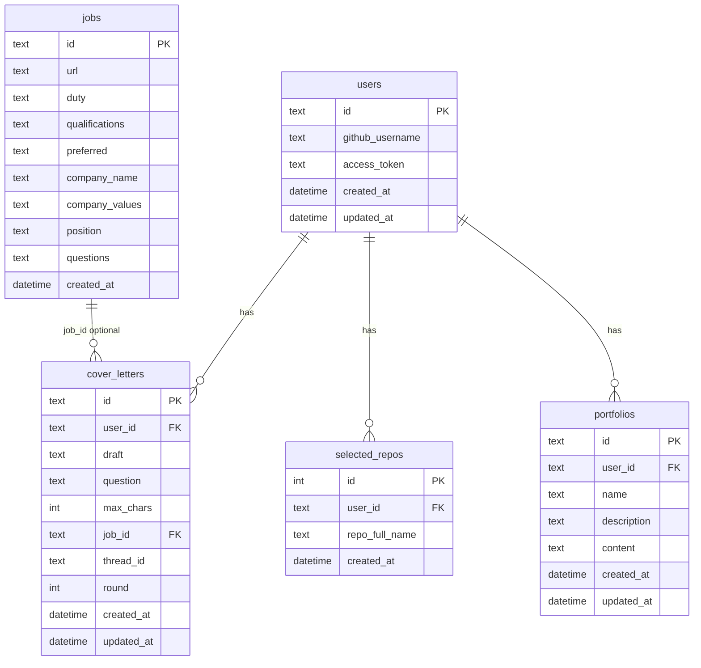

# Autofolio DB 스키마 설계

**문서 버전:** 1.6  
**기준:** [AUTOFOLIO_RAG_파이프라인_핵심.md](AUTOFOLIO_RAG_파이프라인_핵심.md), [AUTOFOLIO_API_스펙.md](AUTOFOLIO_API_스펙.md), [AUTOFOLIO_합격자소서_벡터DB_스키마.md](AUTOFOLIO_합격자소서_벡터DB_스키마.md)

---

## 1. 개요

| 저장소 | 용도 |
|--------|------|
| **SQLite** | users, cover_letters, jobs, selected_repos, portfolios |
| **ChromaDB** | passed_cover_letters (합격 자소서 문항 유사 검색) |
| **ChromaDB** | user_assets_{user_id} (RAPTOR, Job Fit, Writer/Inspector 에셋 조회) |

---

## 2. SQLite 스키마

### 2.1 users (유저)

| 컬럼 | 타입 | 설명 |
|------|------|------|
| `id` | TEXT PK | 유저 고유 ID (GitHub id 등) |
| `github_username` | TEXT | GitHub 사용자명 |
| `access_token` | TEXT | OAuth 토큰 (암호화 권장) |
| `created_at` | DATETIME | 가입 시각 |
| `updated_at` | DATETIME | 수정 시각 |

### 2.2 cover_letters (자소서 초안)

Writer 초안·Inspector 재첨삭 이력 저장. `users.id` FK.

| 컬럼 | 타입 | 설명 |
|------|------|------|
| `id` | TEXT PK | 자소서 고유 ID (UUID 등) |
| `user_id` | TEXT FK | users.id |
| `draft` | TEXT | 초안 내용 (Writer 출력 또는 유저 수정본) |
| `question` | TEXT | 문항 텍스트 |
| `max_chars` | INTEGER | 글자수 제한 |
| `job_id` | TEXT | 공고 ID (jobs.id, 선택) |
| `thread_id` | TEXT | Inspector Human-in-the-loop용 (checkpointer thread_id) |
| `round` | INTEGER | Inspector 재첨삭 라운드 (0=최초) |
| `created_at` | DATETIME | 생성 시각 |
| `updated_at` | DATETIME | 수정 시각 |

### 2.3 jobs (공고 파싱 캐시)

채용 공고 URL → 파싱 결과 캐시. Job Fit·Writer·Inspector에서 재사용.  
파싱 결과는 개별 컬럼으로 저장 (Nullable). 파싱 실패·부분 성공 시에도 저장 가능.

| 컬럼 | 타입 | Nullable | 설명 |
|------|------|----------|------|
| `id` | TEXT PK | | 공고 고유 ID (URL hash 또는 UUID) |
| `url` | TEXT | | 채용 공고 URL |
| `duty` | TEXT | Y | 담당업무 |
| `qualifications` | TEXT | Y | 자격요건 |
| `preferred` | TEXT | Y | 우대사항 |
| `company_name` | TEXT | Y | 기업명 |
| `company_values` | TEXT | Y | 기업인재상 |
| `position` | TEXT | Y | 포지션명 |
| `questions` | TEXT | Y | 자기소개서 문항 목록 (JSON array of strings, 예: `["문항1", "문항2"]`) |
| `created_at` | DATETIME | | 파싱 시각 |

### 2.4 selected_repos (선택 레포)

유저가 선택한 GitHub 레포. `repo_full_name`(owner/repo)으로 레포 구분. `users.id` FK.

| 컬럼 | 타입 | 설명 |
|------|------|------|
| `id` | INTEGER PK | |
| `user_id` | TEXT FK | users.id |
| `repo_full_name` | TEXT | owner/repo |
| `created_at` | DATETIME | |

### 2.5 portfolios (포트폴리오)

유저별 포트폴리오 메타데이터 및 생성 결과물. `users.id` FK.

| 컬럼 | 타입 | 설명 |
|------|------|------|
| `id` | TEXT PK | 포트폴리오 고유 ID (UUID 등) |
| `user_id` | TEXT FK | users.id |
| `name` | TEXT | 포트폴리오명 |
| `description` | TEXT | 설명 (Nullable) |
| `content` | TEXT | 생성된 포트폴리오 (JSON/HTML). build_portfolio 노드 출력 (Nullable) |
| `created_at` | DATETIME | 생성 시각 |
| `updated_at` | DATETIME | 수정 시각 |

---

## 3. ChromaDB — 합격 자소서

**컬렉션:** `passed_cover_letters`

**저장 단위:** 문항(question) 하나당 하나의 문서. 한 자소서에 여러 문항 → 여러 문서.

### 3.1 스키마

| 필드 | 타입 | 설명 |
|------|------|------|
| `id` | str | `{source}_{doc_id}_{q_idx}`. 동일 자소서 문항 묶음은 id에서 `_q_idx` 제거해 추출 |
| `question` | str | 자소서 문항 (질문 텍스트) |
| `answer` | str | 답변 텍스트 |
| `company` | str | 회사명 (메타데이터 필터) |
| `position` | str | 포지션명 (메타데이터 필터) |
| `year` | str | 연도 (메타데이터 필터) |
| `source` | str | `"잡코리아"` \| `"링커리어"` |
| `embedding` | list[float] | 아래 형식 텍스트 임베딩 |

### 3.2 임베딩

- **임베딩 대상:** `{company_name}의 {year}년 {position} 공고의 자기소개서 문항 {n} : {question}`
- **예:** `콜로소의 2022년 데이터 분석가 공고의 자기소개서 문항 1 : 회고 분석을 통한 인사이트 도출에 대해 서술해주세요`
- **이유:** 검색 시 동일 형식으로 쿼리 (`embed(회사명의 year년 position 공고의 자기소개서 문항 1 : user_question)`) → 공고 맥락·문항이 같은 의미 공간에서 비교됨

### 3.3 검색

1. `embed("{company_name}의 {year}년 {position} 공고의 자기소개서 문항 {n} : {user_question}")` → 쿼리 벡터
2. ChromaDB 유사도 검색
3. 메타데이터 필터: `company`, `position`, `year` (job_parsed 있으면)
4. 상위 top_k개 반환 → `(question, answer)` 쌍

---

## 4. ChromaDB — User Asset (유저 에셋)

**컬렉션:** `user_assets_{user_id}` (유저별 컬렉션)

**용도:** RAPTOR 임베딩, Job Fit, Writer/Inspector `load_assets` 에셋 조회.

**저장 단위:** GitHub 코드/폴더/프로젝트 + 이력서/포트폴리오 문서 청크. `type`·`source`로 구분.

### 4.1 타입·출처

| type | 의미 | source | 비고 |
|------|------|--------|------|
| **code** | 소스 코드 파일 (leaf) | github | 본인 커밋만 인덱싱 |
| **folder** | 폴더 요약 (mid) | github | RAPTOR bottom-up |
| **project** | 프로젝트 루트 요약 (root) | github | 레포 전체 요약만 |
| **document** | 이력서/포트폴리오 청크 | resume, portfolio | 전체 요약 없음, 청크만 |

### 4.2 스키마

| ChromaDB 필드 | 타입 | 설명 |
|---------------|------|------|
| `id` | str | `{repo}/{path}` 또는 `{source}_{doc_id}_{chunk_idx}` |
| `document` | str | 임베딩 대상 (summary 우선, 없으면 content) |
| `metadata` | dict | `type`, `source`, `repo`, `path` (MVP 4개) |
| `embedding` | list[float] | 벡터 |

**metadata (MVP 필수 4개):**

| 키 | 타입 | 설명 | code | folder | project | document |
|----|------|------|------|--------|---------|----------|
| `type` | str | `code` \| `folder` \| `project` \| `document` | ✓ | ✓ | ✓ | ✓ |
| `source` | str | `github` \| `resume` \| `portfolio` | ✓ | ✓ | ✓ | ✓ |
| `repo` | str | `owner/repo`. document는 `null` | ✓ | ✓ | ✓ | null |
| `path` | str | 파일/폴더 경로 또는 문서·청크 식별자 | ✓ | ✓ | ✓ | ✓ |

### 4.3 id·path 예시

| type | id 예시 | path 예시 |
|------|---------|-----------|
| code | `owner/repo/src/auth/login.py` | `src/auth/login.py` |
| folder | `owner/repo/src/auth` | `src/auth` |
| project | `owner/repo/` | `"/"` |
| document | `resume_uuid_0` | `resume_uuid_0`, `portfolio_abc_2` |

### 4.4 인덱싱·검색

| 소스 | 트리거 | 처리 |
|------|--------|------|
| **GitHub** | `POST /api/github/repos/{id}/embedding` | 트리 수집 → 본인 커밋 파일만 code 임베딩 → folder/project Bottom-up 요약·임베딩 → ChromaDB upsert |
| **이력서/포트폴리오** | `POST /api/user/documents` | PDF·PPT 업로드 → OCR·청크 분할 → document 임베딩 → ChromaDB upsert |

**상세:** [AUTOFOLIO_User_Asset_스키마_설계.md](AUTOFOLIO_User_Asset_스키마_설계.md), [AUTOFOLIO_임베딩전략.md](AUTOFOLIO_임베딩전략.md)

---

## 5. ER 다이어그램 (SQLite)

### 5.1 Mermaid (GitHub·VS Code·Cursor에서 렌더링)



### 5.2 ASCII (텍스트)

```
users
  │
  ├── cover_letters (user_id FK)
  │       └── job_id → jobs (선택)
  │
  ├── selected_repos (user_id FK)
  │
  └── portfolios (user_id FK)

jobs (독립)
```

---

## 6. 문서 관계

- 합격 자소서 상세: [AUTOFOLIO_합격자소서_벡터DB_스키마.md](AUTOFOLIO_합격자소서_벡터DB_스키마.md)
- User Asset 스키마: [AUTOFOLIO_User_Asset_스키마_설계.md](AUTOFOLIO_User_Asset_스키마_설계.md)
- User 프로필 임베딩: [AUTOFOLIO_임베딩전략.md](AUTOFOLIO_임베딩전략.md)
- RAG 파이프라인: [AUTOFOLIO_RAG_파이프라인_핵심.md](AUTOFOLIO_RAG_파이프라인_핵심.md)
- API 스펙: [AUTOFOLIO_API_스펙.md](AUTOFOLIO_API_스펙.md)

---

## 7. 문서 이력

- 1.0: DB 스키마 설계 초안. SQLite(users, user_cover_letters, jobs, user_selected_repos), ChromaDB(합격 자소서 question만 임베딩).
- 1.1: jobs.parsed → 개별 컬럼(담당업무, 자격요건, 우대사항, 기업명, 기업인재상, 포지션명) Nullable. 합격자소서 임베딩 → question+answer.
- 1.2: jobs.questions 추가. 합격자소서 임베딩 → `{company}의 {year}년 {position} 공고의 자기소개서 문항 {n} : {question}`.
- 1.3: portfolios 테이블 추가 (user_id FK). User Asset VectorDB 키=user_id.
- 1.4: portfolios.content 컬럼 추가 (생성 결과물 저장).
- 1.5: Mermaid ER 다이어그램 추가 (시각화).
- 1.6: user_cover_letters→cover_letters, user_selected_repos→selected_repos. User Asset 스키마 통합 (type, metadata, id/path).
